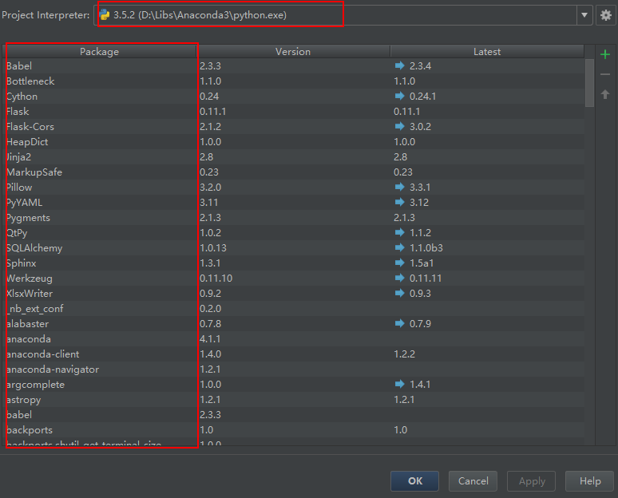

##Python科学环境配置

[TOC]

### Python IDE 开发环境（PyCharm）

1. 官网下载[IDE](https://www.jetbrains.com/pycharm/download/#section=windows)，选择与你操作系统相应的版本，下载；
2. 一直点击下一步，完成IDE工具安装；

### Anaconda下载安装

Anaconda为Python的科学计算发行版，其中包括numpy、scipy和matplotlib。该发行版将python科学计算所需要的模块编译完成并打包发行，方便用户使用。

Anaconda特点：

	* 包含了众多流行的科学、数学、工程、数据分析的Python包；
	* 完全开源和免费
	* 额外的加、优化是收费的，但对于学术用途可以申请免费的License
	* 全平台支持：Linux、Windows、Mac
	* 支持Python2.6、2.7、3.3、3.4,可自由切换

1. 官网下载[Anaconda](https://www.continuum.io/downloads)，根据自身系统环境和使用的python版本选择相应的安装文件（python支持2.x和3.x版本）
2. 双击安装Anaconda;

### 开发环境配置

配置pycharm解释器
Settings-->Project-->Project Interpreter 右边选择齿轮标志选择Anaconda中python.exe（Windows环境下），点击确定。经过一段时间的等待，Pycharm会自动解析展示所有的包信息。
